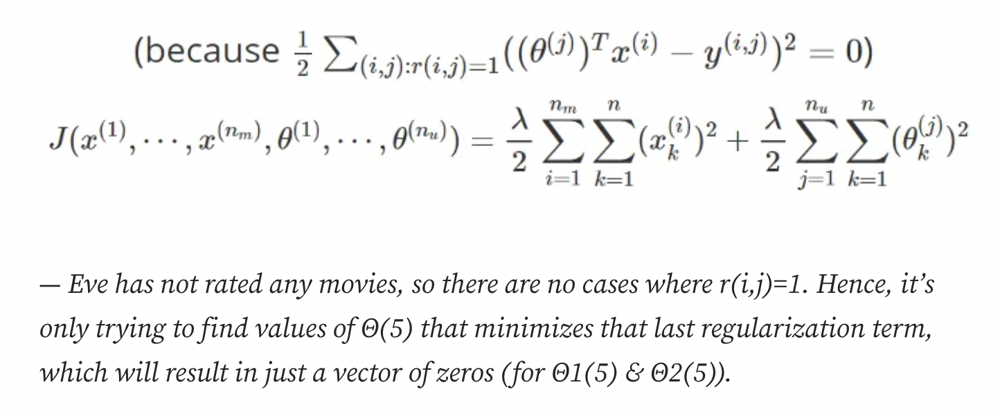

# Recommender Systems implementation detail

## Intro

- this is a summary of [Recommendation System Course in Courser by Deeplearning.ai](https://www.coursera.org/learn/unsupervised-learning-recommenders-reinforcement-learning/)

## Mean Normalization



- If we have a new user who rated nothing, then we are difficult to recommend items with given cost function.
- so that, we need to normalize the values


## Finding related items

- We can find a similar item to item i, we can find item k with feature of k to Xi
  - the distance of Xi and Xk could be the way


# Content-based filtering

## Collaborative filtering vs Content-based filtering

- Collaborative filtering: Recommend items to you based on ratings of users who gave similar ratings as you
- Content-based filtering: Recommend items to you based on features of user and item to find good match
  - User features: Age, Gender, Country, Movies watch...
  - Movie features: Year, Genre, Reviews, Average rating...
  - *two feature vector sizes colud be different*

## Deep learning for content-based filtering

- We can get same size of the vectors from user's preference and movie's feature using Neural Networks.


## Recommending from a large catalogue

- Computing recommendtations for Millions of user and items is infeasible

### Two Steps

1. Retrieval

- Generate large list of plausible item candidates
  1. For each of the last 10 movies watched by the user, find 10 most similar movies
  2. For most viewed 3 genres, find the top 10 movies
  3. Top 20 movies in the country
- Combine retrieved items into list, removing duplicates and items already watched/purchased

2. Ranking
- Take list retrieved and rank using learned model
- Display tranked items to user

- Retrieving more items results in better performance, bu slower recommendations
- To analyse/optimize the trade-off, carry out offline experiments to see if retrieving additional items results in more relevant recommendations

## Ethical use of recommender systems

### The goal of the recommender system

- Movies most likely to be rated 5 start by user
- Products most likely to be purchased
- Ads most likely to be clicked on
- Products generating the larges profit
- Video leading to maximum watch time

### Ethical considerations with recommender systems

- Good Example: Travel indstry(Good experience -> More Profitable -> Bid higher for ads)
- Bad Example: Payday loans(Squeeze customers more -> More profit -> Bid higher for ads)

### Other probelmatic cases

- Maximizing user engagement has led to large social media sharing sites to amplify conspiracy theories and hate
- Can a ranking system maximize your profit rather than user's welfare be presented in a transparent way


## Summary

- 협업 필터링은 사용자의 행동 정보(별점 등)을 기반으로 추천하는 것
- 컨텐츠 기반 필터링은 유저나 사용자의 정보(나이, 제품특징 등)을 기반으로 추천하는 것
- 유저 및 아이템의 피쳐를 신경망을 통해 임베딩 할 수 있음
- 코드로 표현하면 아래와 같음

```python3
net = Net()

Xm_j = [2, 5, ...] # features of movie j
Xm_k = [3, 6, ...] # features of movie k

Vu_i = [0.3, 0.3, ...] # a vector of user i from Xu_i
Vm_j = net(Xm_j) # a vector of movie j from Xm_j
Vm_k = net(Xm_k) # a vector of movie k from Xm_k

assert len(Vm_j) == (Vm_k), "the size of vectors must be same"

similarity = similiarty_func(Vm_j, Vm_k) # the higher, the similar
```


# Reference

- [Main Course](https://www.coursera.org/learn/unsupervised-learning-recommenders-reinforcement-learning/)
- [Recommender Systems: Content-Based Recommendations & Collaborative Filtering](https://medium.com/mlearning-ai/recommender-systems-content-based-recommendations-collaborative-filtering-full-6483b6caa5eb#527d)